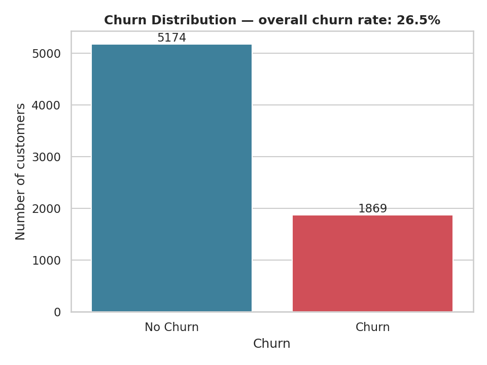
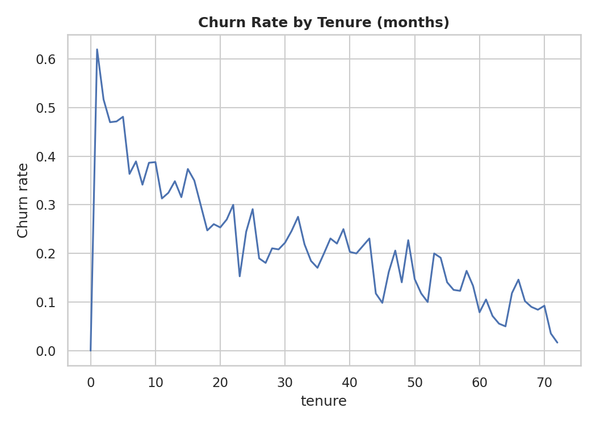
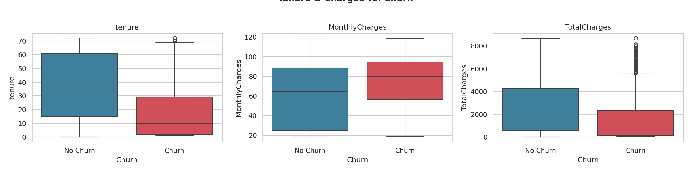
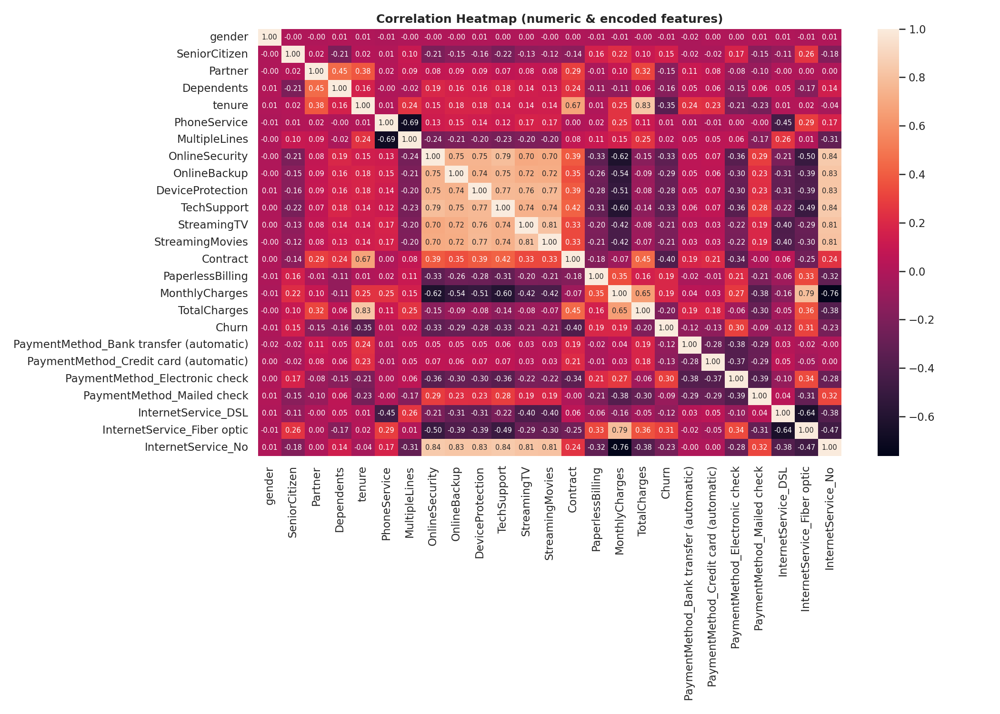
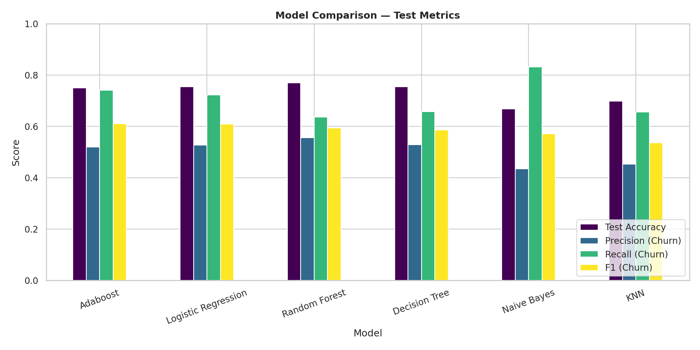
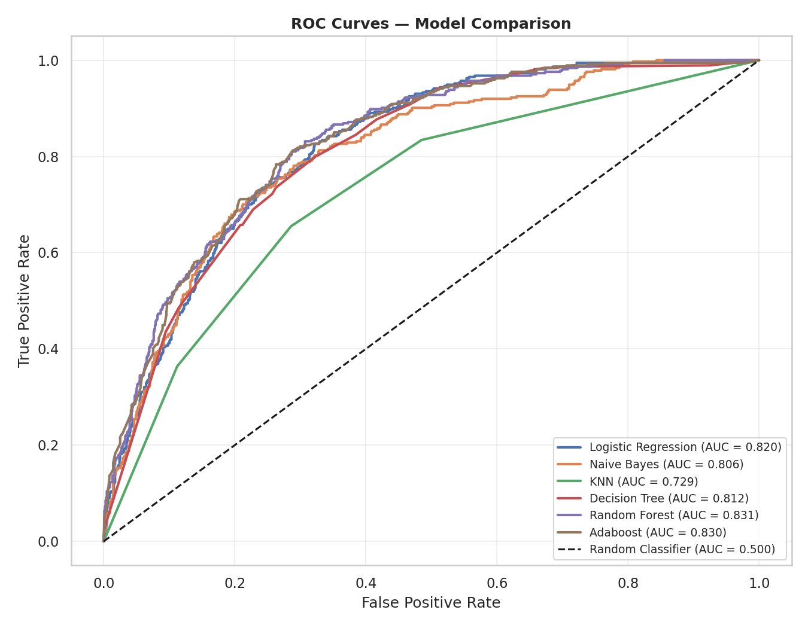
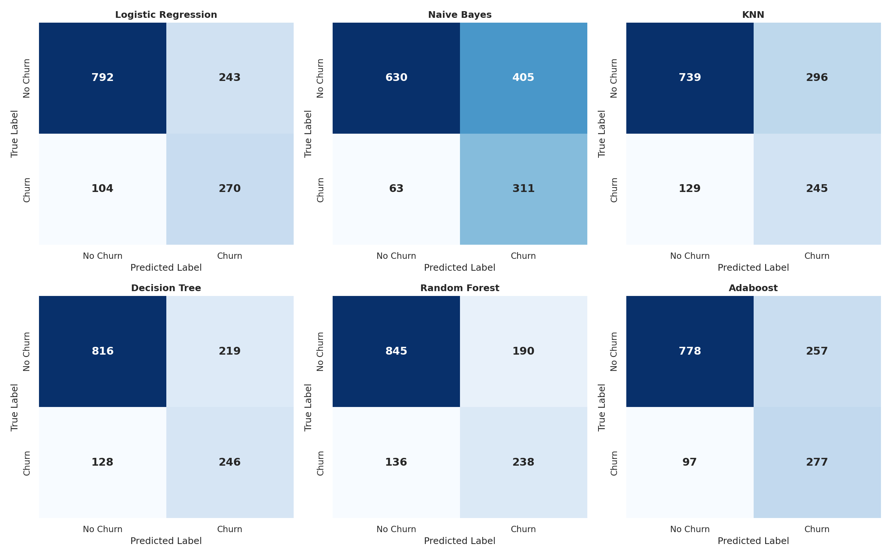
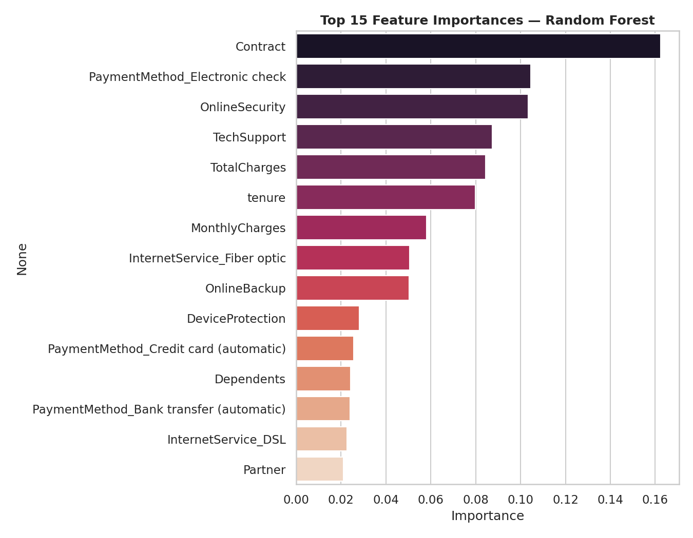

<div align="center">

# 📉 Telco Customer Churn — Prediction & Analysis

**Predicting which telecom customers are about to leave — and why.**

[](https://www.python.org/)
[](https://scikit-learn.org/)
[](https://pandas.pydata.org/)
[](https://jupyter.org/)
[](LICENSE)

</div>

---

## 📌 Overview

Customer churn — when a customer cancels their subscription — is one of the costliest problems for a telecom company, since acquiring a new customer is far more expensive than retaining an existing one.

This project builds a full, end-to-end churn-prediction pipeline on the **IBM Telco Customer Churn** dataset (7,043 customers, 21 attributes covering demographics, account information, and subscribed services). It walks through cleaning, exploratory analysis, feature engineering, class-imbalance correction, and the training/tuning/comparison of **six classification models**, finishing with a feature-importance breakdown and concrete business recommendations.

**Overall churn rate in the dataset: ~26.6%**

<p align="center">
  
</p>

---

## 🗂️ Project Structure

```
.
├── Telco_Customer_Churn_Prediction.ipynb   # Main analysis & modeling notebook
├── data/
│   └── WA_Fn-UseC_-Telco-Customer-Churn.csv
├── images/                                 # Exported charts (used in this README)
│   ├── churn_distribution.png
│   ├── correlation_heatmap.png
│   ├── numeric_vs_churn.png
│   ├── churn_by_tenure.png
│   ├── model_comparison.png
│   ├── roc_curves.png
│   ├── confusion_matrices.png
│   └── feature_importance.png
├── requirements.txt
└── README.md
```

---

## 🔬 Methodology

| Stage | What happens |
|---|---|
| **1. Data Cleaning** | Drop `customerID`, fix `TotalCharges` (blank → numeric → imputed), encode binary/ordinal/nominal categorical fields |
| **2. EDA** | Churn distribution, correlation heatmap, tenure/charges vs. churn, churn rate over tenure |
| **3. Feature Engineering** | Ordinal encoding for service/contract fields, one-hot encoding for `PaymentMethod` & `InternetService` |
| **4. Train/Test Split** | 80/20 stratified split |
| **5. Class Balancing** | `SMOTE` applied to the **training set only** (test set kept untouched for honest evaluation) |
| **6. Modeling** | 6 classifiers tuned with `RandomizedSearchCV` (5-fold-equivalent CV, optimizing F1) |
| **7. Evaluation** | Accuracy, Precision, Recall, F1, ROC-AUC, confusion matrices |
| **8. Interpretation** | Random Forest feature importances → business recommendations |

**Models compared:** Logistic Regression · Naive Bayes · K-Nearest Neighbors · Decision Tree · Random Forest · AdaBoost

---

## 📊 Exploratory Highlights

<table>
<tr>
<td width="50%"></td>
<td width="50%"></td>
</tr>
</table>

- Churn is heavily concentrated among **low-tenure customers** — risk drops sharply the longer someone stays.
- Churners tend to pay **higher monthly charges**, and (unsurprisingly, since they leave early) have **lower total lifetime charges**.
- `Contract` type is one of the strongest single predictors of churn — see the correlation heatmap below.

<p align="center">
  
</p>

---

## 🤖 Model Results

All models trained on SMOTE-balanced data, evaluated on an untouched, stratified 20% test set. Sorted by F1-score on the churn class (the metric that matters most for an imbalanced, cost-asymmetric problem like this one).

| Model | Test Accuracy | Precision (Churn) | Recall (Churn) | F1 (Churn) | ROC-AUC |
|---|---|---|---|---|---|
| **AdaBoost** | 0.749 | 0.519 | 0.741 | **0.610** | 0.830 |
| Logistic Regression | 0.754 | 0.526 | 0.722 | 0.609 | 0.820 |
| Random Forest | 0.769 | 0.556 | 0.636 | 0.594 | **0.831** |
| Decision Tree | 0.754 | 0.529 | 0.658 | 0.586 | 0.812 |
| Naive Bayes | 0.668 | 0.434 | **0.832** | 0.571 | 0.806 |
| KNN | 0.698 | 0.453 | 0.655 | 0.536 | 0.729 |

> 💡 **Naive Bayes catches the most churners (83% recall)** but at the cost of many false alarms. **Random Forest has the best overall ranking ability (highest ROC-AUC)**. **AdaBoost gives the best balance** between catching churners and avoiding false positives — the top pick if a single model must be chosen. The right choice ultimately depends on the retention team's tolerance for false positives vs. missed churners.

<p align="center">
  
</p>

<table>
<tr>
<td width="50%"></td>
<td width="50%"></td>
</tr>
</table>

### Feature Importance (Random Forest)

<p align="center">
  
</p>

---

## 💡 Key Business Recommendations

1. **Target new customers early.** Churn risk is highest in the first few months — prioritize retention outreach for month-to-month customers in their first 90 days.
2. **Push longer-term contracts.** Offer incentives (discounts, perks) for customers to move from month-to-month to 1-/2-year contracts.
3. **Bundle stickiness features.** Online Security and Tech Support correlate with lower churn — consider including them by default in onboarding packages.
4. **Build a proactive watchlist.** Use the model's predicted churn probability to flag at-risk customers for the retention team before they cancel.

---

## 🚀 Getting Started

### 1. Clone the repository
```bash
git clone https://github.com/<your-username>/telco-customer-churn.git
cd telco-customer-churn
```

### 2. Set up the environment
```bash
python -m venv venv
source venv/bin/activate      # Windows: venv\Scripts\activate
pip install -r requirements.txt
```

### 3. Run the notebook
```bash
jupyter notebook Telco_Customer_Churn_Prediction.ipynb
```

The dataset is already included under `data/`, so the notebook runs end-to-end with no additional downloads.

---

## 🛠️ Tech Stack

`Python` · `pandas` · `NumPy` · `scikit-learn` · `imbalanced-learn` (SMOTE) · `matplotlib` · `seaborn` · `Jupyter`

---

## 📁 Dataset

[IBM Telco Customer Churn](https://www.kaggle.com/datasets/blastchar/telco-customer-churn) — 7,043 rows × 21 columns, covering customer demographics, account tenure/contract/billing details, and subscribed services (phone, internet, streaming, security add-ons).

---

## 📄 License

This project is licensed under the [MIT License](LICENSE) — feel free to use, modify, and share.

---

## 🙋 Author

Built as a portfolio / educational data science project. Contributions, issues, and suggestions are welcome — feel free to open a pull request or issue.

</div>
